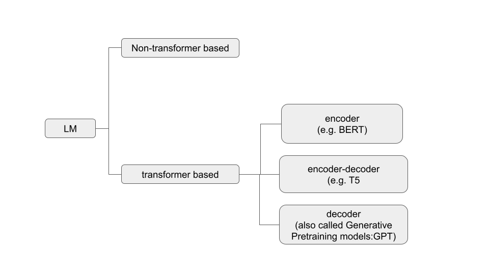

# Focus on decoder models 

Simply put, a language model (LM) is a mathematical representation of (written) words and the relationships between them. 

[N.B: words here have to be understood in a wider sense as to include also other language symbols such as punctuation, space ...). 

LM came in different flavors. 

Our focus in this repo will be mainly on (transformer-based) decoder-only LM (see below)

We will focus on 
- relatively small LM (small as in "*can run on consumer hardware*") 
- open models (open as in "*weights are on huggingface*")  

In particular, we will be looking into following models : 

**Eleuther**

EleutherAI/gpt-neo-125m

EleutherAI/gpt-neo-1.3B

EleutherAI/gpt-neo-2.7B

EleutherAI/gpt-j-6b

**Cerebras-GPT**

cerebras/Cerebras-GPT-111M

cerebras/Cerebras-GPT-256M

cerebras/Cerebras-GPT-590M

cerebras/Cerebras-GPT-1.3B

cerebras/Cerebras-GPT-2.7B

cerebras/Cerebras-GPT-6.7B

**Meta LLaMa** 

decapoda-research/llama-7b-hf

## Other interesting overviews : 

https://kipp.ly/blog/transformer-taxonomy/?utm_source=substack&utm_medium=email

https://finbarr.ca/five-years-of-gpt-progress/

